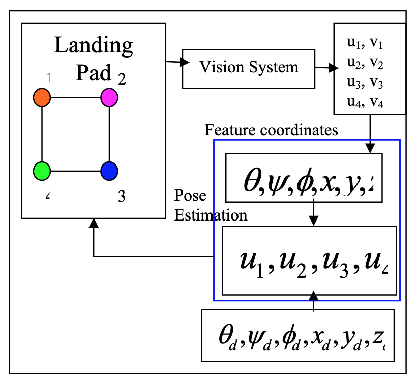

# Overview

## Purpose
This readme is designed to keep a log of my progress as I work through the real time embedded software case study. 

## Problem Overview
- see case study document...
- Localisation problem in continuously-defined space
- Outcome requires a unimodal estimate of the target position

## Problem Breakdown
Step 1: Identify/generate a potential state space model to model the Swoop Aero vehicle
Step 2: Generate test-data to simulate the vehicle in cartesian coordinates during each landing phase
	- Amend this idealised simulation data by introducing typical lida errors
Step 3: Implement a visualiser in order to visualise the above [x,y,z] vehicle information
Step 4: Implement KF to estimate height of the vehicle relative to ground
	- May be able to get away with a linear KF since each of the landing phases is linear... ?
Step 5: Extend the model by addressing "bonus points" requirements
	- This seems to be an extension of the KF model to be non-linear domain... Possibly EKF?

Can visualise the problem by considering the following diagram from [3].
- This case study considers the model in the blue box. 
- Inputs to the model are the values from the vision system (i.e. lidar). 
- The output of the model will be vehicle's pose estimation / position in the cartesian grid...

 

## Design Considerations

### Assumptions
- The problem solution will not consider control of the aircraft. Closed loop control of the aircraft is implied via the landing profile.
- Due to absence of vehicle characteristics, information required for simulation/KF implementation will be derived from existing literature.
- SI units will be utilised throughout the case study.
- Measurement/clock cycle for the vehicle is chosen to be 100ms for ease of computation. This sampling rate may not be representative of the actual vehicle. 

### Constraints
- Solution to the first part of the case study involves a linear kalman filter for estimation of the aircraft height above ground since the vehicle is in "hover" state during landing.[2]
- Solution to the second part of the case study involves a non-linear kalman filter for estimation of the aircraft height above ground.[2]
- The simulation data (e.g. duration of each landing phase) may be adjusted from within the simulation class.
- For ease of computation, the landing sequence can complete within 30min. This is an arbitrary value. 
- In the interest of time, third party C++ libraries may be utilised for non-core aspects of the case study e.g. for matrix algebra (e.g. Eigen Library) and for plotting (e.g. GNUPlot/matplot++ libraries). [4][6]
- Code has been tested with C++23/2b compiler standard / Apple Clang version 13.0.0 -- tested on MacOS Big Sur (v11.6.8) [5]

## Architectural Design

### Component Diagram

### Deployment Diagram
- N/A...

## Low-Level Design

### Class Diagram

## References
[1] [State Space Representation](https://en.wikipedia.org/wiki/State-space_representation)
[2] [Full Linear Control of a Quadrotor UAV, LQ vs H∞](https://sci-hub.se/10.1109/control.2014.6915128)
[3] [Modeling and PD Control of a Quadrotor VTOL Vehicle](https://www.researchgate.net/publication/224719830)
[4] [gnuplot-cpp](https://code.google.com/archive/p/gnuplot-cpp/)
[5] [C++ Compiler Support](https://en.cppreference.com/w/cpp/compiler_support)
[6] [Eigen 3.4.0](https://gitlab.com/libeigen/eigen/-/releases/3.4.0)
[7] [Kalman Filter Overview](https://www.kalmanfilter.net/default.aspx)

